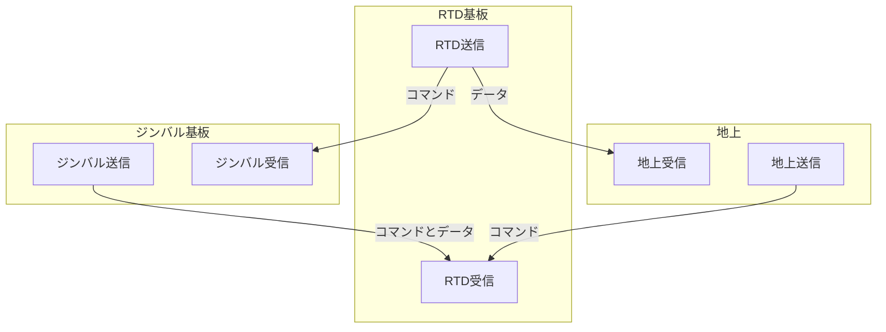
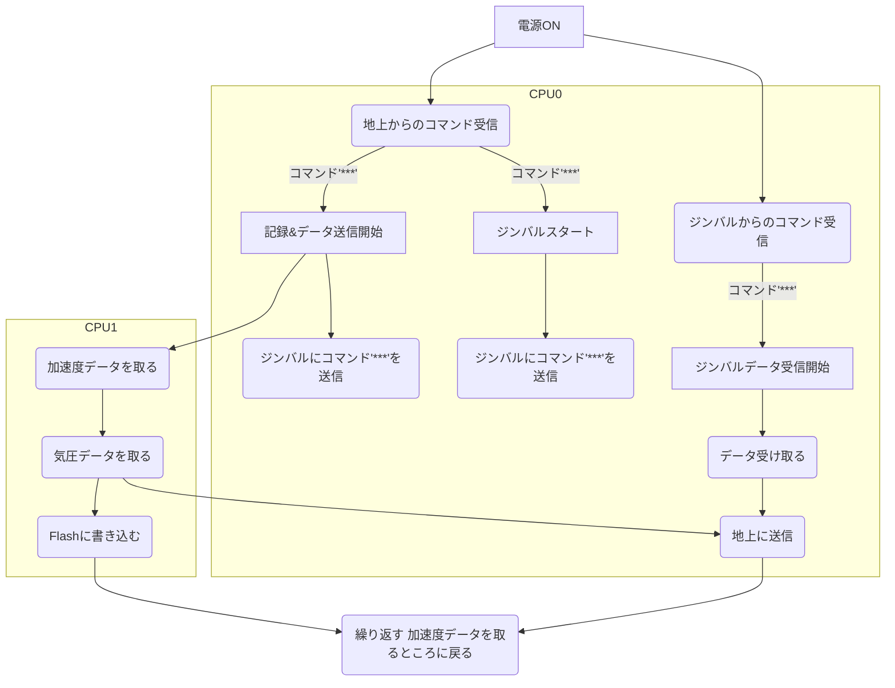
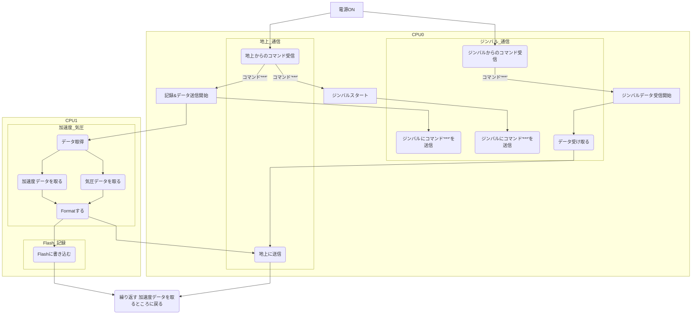
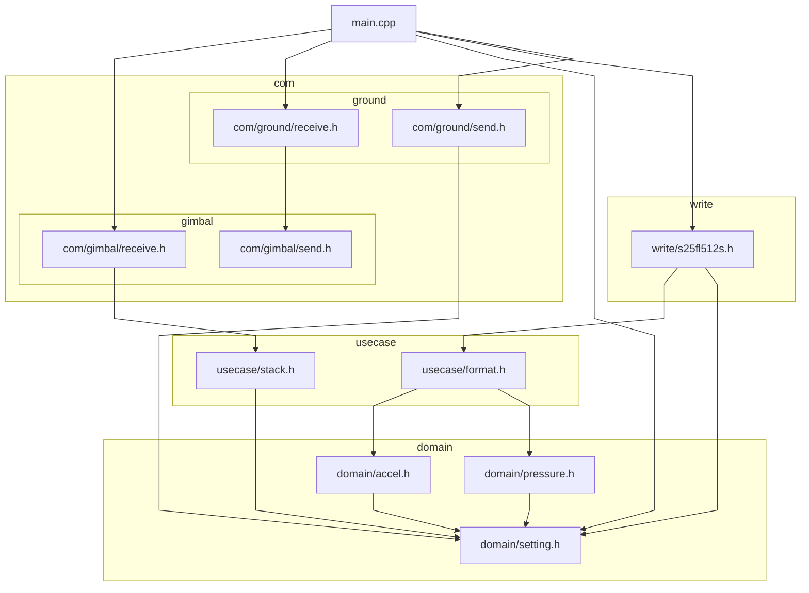

# Avi_73J_Board v2

## システム構成 v2

## RTD基板システム要件 v2

### 各基板とのつながり v2

```mermaid
graph TD
    subgraph ジンバル基板
        D[ジンバル送信]
        A[ジンバル受信]
    end
    subgraph RTD基板
        B[RTD送信]
        E[RTD受信]
    end
    subgraph 地上
        F[地上受信]
        C[地上送信]
    end
    D -->|コマンドとデータ| E  
    B -->|コマンド| A
    B -->|データ| F
    C -->|コマンド| E
```

### RTD基板の仕様 v2

```mermaid
graph TD
    subgraph CPU0
        B
        C
        F
        G
        K
        N
        D
        E
        M
    end
    subgraph CPU1
        H
        I
        J
    end
    A[電源ON] --> B(地上からのコマンド受信)
    A --> C(ジンバルからのコマンド受信)
    B --> |コマンド'***'| D[記録&データ送信開始]
    B --> |コマンド'***'| E[ジンバルスタート]
    E --> G(ジンバルにコマンド'***'を送信)
    D --> F(ジンバルにコマンド'***'を送信)
    D --> H(加速度データを取る)
    H --> I(気圧データを取る)
    I --> J(Flashに書き込む)
    I --> K(地上に送信)
    J --> L(繰り返す 加速度データを取るところに戻る)
    K --> L
    C --> |コマンド'***'| M[ジンバルデータ受信開始]
    M --> N(データ受け取る)
    N --> K
```

### 実装 v2

```mermaid
%%{ init: { 'flowchart': { 'curve': 'linear' } } }%%

graph TD
    subgraph CPU0
        subgraph ジンバル_通信
            B
            N
            G
            F
        end
        subgraph 地上_通信
            K
            C
        end
        D
        E
        M
    end
    subgraph CPU1
        subgraph 加速度_気圧
            P
            H
            I
            O
        end
        subgraph Flash_記録
            J
        end
    end
    A[電源ON] --> C(地上からのコマンド受信)
    A --> B(ジンバルからのコマンド受信)
    C --> |コマンド'***'| D[記録&データ送信開始]
    C --> |コマンド'***'| E[ジンバルスタート]
    E --> G(ジンバルにコマンド'***'を送信)
    D --> F(ジンバルにコマンド'***'を送信)
    D --> P(データ取得)
    P --> H(加速度データを取る)
    P --> O(気圧データを取る)
    O --> I(Formatする)
    H --> I
    I --> J(Flashに書き込む)
    I --> K(地上に送信)
    J --> L(繰り返す 加速度データを取るところに戻る)
    K --> L
    B --> |コマンド'***'| M[ジンバルデータ受信開始]
    M --> N(データ受け取る)
    N --> K
```

### ディレクトリ依存関係 v2

```mermaid
%%{ init: { 'flowchart': { 'curve': 'linear' } } }%%

graph TD
    subgraph domain
        A
        C
        D
    end
    subgraph usecase
        B
        K
    end
    subgraph write
        E
    end
    subgraph com
        subgraph ground
            F
            I
        end
        subgraph gimbal
            G
            H
        end
    end
    B[usecase/format.h] --> A[domain/accel.h]
    B[usecase/format.h] --> C[domain/pressure.h]
    C --> D[domain/setting.h]
    A --> D
    E[write/s25fl512s.h] --> B
    E[write/s25fl512s.h] --> D
    F[com/ground/send.h] --> D
    I[com/ground/receive.h] --> G[com/gimbal/send.h]
    H[com/gimbal/receive.h] --> K[usecase/stack.h]
    J[main.cpp] --> H
    J[main.cpp] --> I
    J[main.cpp] --> D
    J[main.cpp] --> E
    J[main.cpp] --> F
    K[usecase/stack.h] --> D    
```
